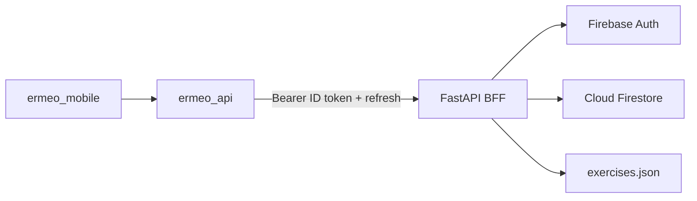

# Backend / BFF

How the Flutter monorepo talks to the Ermeo backend. The BFF lives in a **sibling repo** (`../backend`), not in this workspace.

## Stack (fixed)

| Concern | Technology |
|---------|------------|
| API / BFF | FastAPI (Python 3.12+) + Uvicorn |
| Auth | Firebase Auth (email/password), proxied by BFF |
| Database | Cloud Firestore |
| Exercise catalog | Static `data/exercises.json` (loaded at startup) |
| Contract | OpenAPI 3.1 — backend owns the canonical file |
| Client | `packages/ermeo_api` (OpenAPI → Dio + hand-written facade) |
| Local URL | `http://localhost:8000` (`ERMEO_API_BASE_URL`) |
| Firebase projects | `ermeo-dev` (local/CI), `ermeo-prod` (production) |

## Why this shape

- **Contract-first:** mobile regenerates from `GET /openapi.yaml`; FastAPI matches that workflow.
- **No Firebase SDK in Flutter:** auth is `/auth/register|login|refresh` on the BFF. Tokens fit `AuthInterceptor` and `SessionService` in `ermeo_api`.
- **Firestore:** document-shaped domain (workouts, sessions, assignments) and Admin SDK already required for Auth.
- **Package boundary:** only `ermeo_mobile` depends on `ermeo_api`; UI/monitoring stay Firebase-free.

Do **not** add a Flutter Firebase Auth client, Supabase, Auth0, GraphQL, or gRPC for the main product API unless an ADR changes this document.

## Auth and IDs

- Access token = Firebase **ID token**; refresh token = Firebase **refresh token** (fields `accessToken` / `refreshToken`).
- Protected routes: `Authorization: Bearer <accessToken>`.
- Session `userId` values are **Firebase Auth UIDs** (opaque strings), not UUIDs.
- Workout / session / assignment / profile IDs remain UUIDs where the OpenAPI `format: uuid` says so.
- Roles: `athlete` | `instructor` | `admin` (set at register; enforced on assignments and athlete session reads).

## Local development

1. Configure and run the sibling backend (see its README): `uvicorn app.main:app --reload --port 8000`.
2. Run the app with default `ERMEO_API_BASE_URL=http://localhost:8000` (or Melos localhost target).
3. After backend contract changes: `melos run generate:api` from this repo root.

## Errors

BFF error bodies use `{ "code", "message", "details"? }`. Repositories should call APIs through `ErmeoApiClient.run(...)` so failures become `ApiException`.

## Related

- [`packages/ermeo_api/README.md`](../../packages/ermeo_api/README.md) — client usage and codegen
- [`docs/principles/architecture.md`](../principles/architecture.md) — package boundaries
- [`docs/principles/tooling.md`](../principles/tooling.md) — `melos run generate:api`
- Sibling backend: `../backend/README.md`
