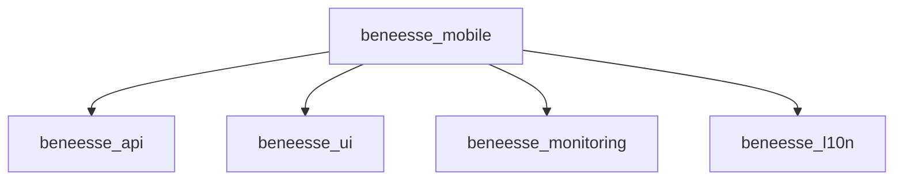

# Architecture principles

## Monorepo layout

```text
beneesse/
├── apps/           # Runnable Flutter applications
├── packages/       # Shared libraries consumed by apps
├── docs/           # Project principles and guides
├── pubspec.yaml    # Workspace root + Melos configuration
└── .fvmrc          # Pinned Flutter version (3.44.0)
```

- **Apps** live under `apps/`. They compose packages and own app-specific wiring (routing, DI, feature modules).
- **Packages** live under `packages/`. They expose reusable, testable units with a clear public API in `lib/`.
- The **workspace root** is not an app. Do not add application code at the repository root.

## Packages

| Package | Type | Role |
|---------|------|------|
| `beneesse_api` | Pure Dart | HTTP clients, DTOs, API contracts — no Flutter dependency |
| `beneesse_ui` | Flutter | Shared widgets, themes, design system |
| `beneesse_monitoring` | Flutter | Logging, crash reporting, analytics, observability |
| `beneesse_l10n` | Flutter | ARB strings, generated `BeLocalizations`, localization helpers |
| `beneesse_mobile` | Flutter app | End-user mobile application |

## Dependency rules

These rules are **fixed** unless explicitly changed in this document and agreed by the team.



- **`beneesse_mobile`** may depend on workspace packages listed above.
- **`beneesse_api`** is consumed **only** by `beneesse_mobile`. UI and monitoring must not import it.
- **`beneesse_ui`**, **`beneesse_l10n`**, and **`beneesse_monitoring`** are standalone. They must not depend on `beneesse_api` or on each other unless a future ADR says otherwise.
- **Packages must not depend on apps.**

Rationale: the API layer stays in the app’s domain. UI and monitoring remain reusable without coupling to backend contracts.

## Application architecture (Clean Architecture)

`beneesse_mobile` follows Clean Architecture with **flutter_bloc** and a **BLoC → Repository** flow (no use-case layer). See [clean-architecture.md](clean-architecture.md) for folder layout, layer rules, and anti-patterns.

## Where code belongs

| Concern | Location |
|---------|----------|
| API clients, DTOs | `packages/beneesse_api` |
| Feature repositories, converters | `apps/beneesse_mobile/lib/features/<feature>/data/` |
| Feature models | `apps/beneesse_mobile/lib/features/<feature>/models/` |
| BLoC + events/states | `apps/beneesse_mobile/lib/features/<feature>/bloc/` |
| Screens/widgets | `apps/beneesse_mobile/lib/features/<feature>/presentation/{pages,views,widgets}/` |
| Shared design system | `packages/beneesse_ui` |
| User-visible strings (ARB, `BeLocalizations`) | `packages/beneesse_l10n` |
| Crashlytics, Sentry, analytics wrappers | `packages/beneesse_monitoring` |
| Router, DI, app bootstrap, cross-feature utilities | `apps/beneesse_mobile/lib/core/` |

When unsure, prefer the **smallest package** that can own the code without violating dependency rules.

## Adding a new package or app

1. Create the directory under `apps/` or `packages/`.
2. Set `publish_to: none` and `resolution: workspace` in its `pubspec.yaml`.
3. Register the path in the root `pubspec.yaml` `workspace:` list.
4. Add a `README.md` describing purpose, public API, and allowed dependents.
5. Run `fvm dart pub get` at the repository root.

## Public API discipline

- Export only what consumers need from `lib/<package_name>.dart`.
- Keep implementation details in private files or `src/` if the package grows.
- Breaking changes to a package API require updating all dependents in the same change set.
