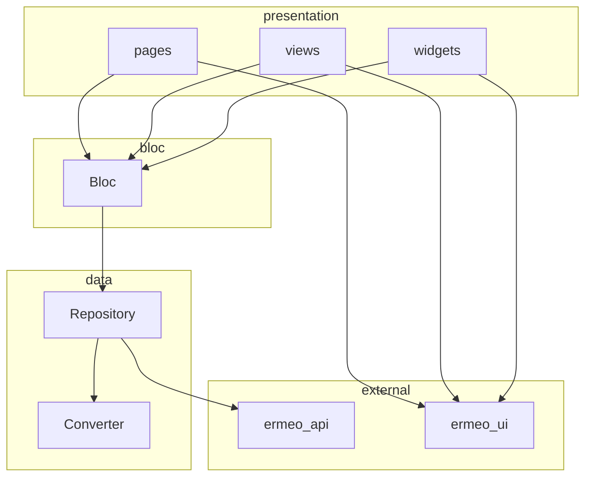

# Clean Architecture

Primary reference for `ermeo_mobile` app structure, layer rules, and BLoC conventions.

## App layout

Feature code lives under `apps/ermeo_mobile/lib/`:

```text
lib/
├── core/                    # Shared across the whole app (DI, router, theme wiring, base types)
└── features/
    └── <feature_name>/
        ├── bloc/
        ├── presentation/
        │   ├── views/
        │   ├── widgets/
        │   └── pages/
        ├── data/            # converters + repositories (call ermeo_api / local sources)
        └── models/
```

- **`core/`** — cross-feature concerns only (router, DI, shared blocs/utils, app bootstrap). Not feature-specific screens.
- **`features/<feature_name>/`** — one folder per feature; each feature owns its BLoC, presentation, data, and models.

## Layer flow

BLoC calls repositories directly. There is **no `use_cases` layer**.



Presentation dispatches events to BLoC and renders state. BLoC orchestrates business logic and calls repositories. Repositories use converters and `ermeo_api` (or local/DB sources). Presentation may import `ermeo_ui` for shared widgets but must not reach into data or API layers.

## Non-negotiable rules

| Rule | Detail |
|------|--------|
| State management | **flutter_bloc** only; all business logic, orchestration, and **display formatting** live in BLoC |
| Presentation is dumb | No repository imports, no API calls, no formatting logic in `presentation/` — only render state and dispatch events |
| BLoC → Repository | BLoC calls repository interfaces/implementations directly; **no `use_cases` layer** |
| Data layer | Repositories + converters in `data/`; repositories call `ermeo_api` (or local/DB), converters map API/DTO shapes → feature `models/` |
| Models | Feature-owned domain models in `models/`; API DTOs stay in [`ermeo_api`](../../packages/ermeo_api) |
| Core | Cross-feature concerns only (router, DI, shared blocs/utils, app bootstrap) — not feature-specific screens |
| Package boundaries | Unchanged: `ermeo_api` consumed only by `ermeo_mobile`; UI/monitoring packages remain independent |

## Anti-patterns

Do **not**:

- Put business logic, validation, or display formatting in widgets, views, or pages.
- Import repositories or call APIs from `presentation/` (including `context.read<Repository>()`).
- Format dates, currency, labels, or derived display strings in `build()` — compute them in BLoC and expose via state.
- Bypass BLoC by calling repositories or services directly from UI code.
- Add a `use_cases/` folder or interpose use-case classes between BLoC and repository.
- Put feature-specific screens or BLoCs in `core/`.

When in doubt, ask: *does this file only render state and dispatch events?* If not, it belongs in BLoC or `data/`.

## Related docs

- [Architecture](architecture.md) — monorepo layout and package dependency rules
- [Routing](../guides/routing.md) — `@RoutePage`, typed navigation, deeplinks
- [Testing](testing.md) — coverage requirements for BLoCs, repositories, and packages
- [Code quality](code-quality.md) — Dart/Flutter standards and presentation rules
